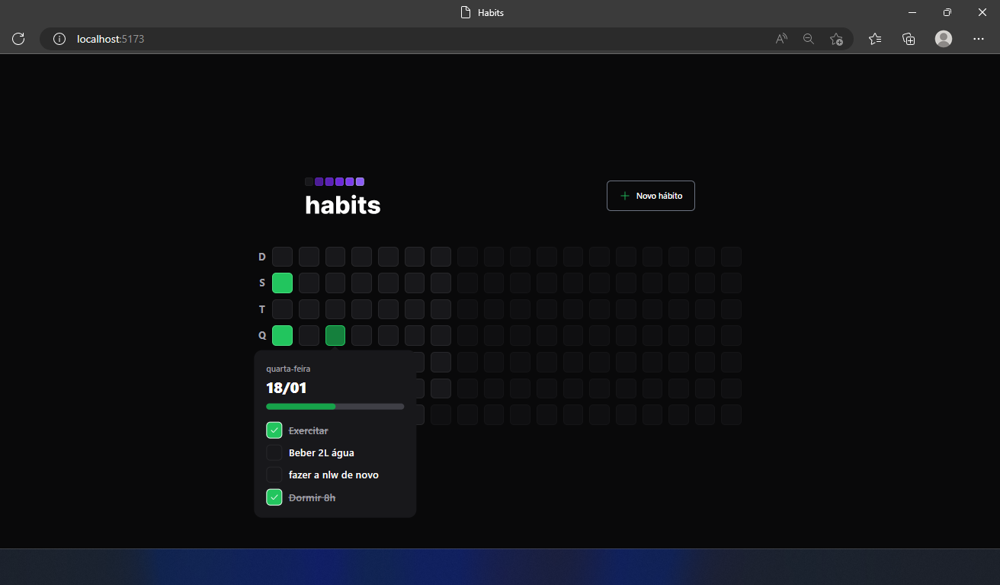

# Sobre o projeto
Criação de hábitos diários.

Projeto desenvolvido partindo do evento NLW-SETUP organizado pela @rocketseat

# Para rodar o projeto
No terminal, para rodar o servidor execute:

### `cd server`
### `npm install`
### `npm run dev`

Abra outro terminal e execute:

### `cd web`
### `npm install`
### `npm run dev`

## Para vizualizar a interface do DB no navegador 

Abra outro terminal e execute:

### `npx prisma studio`

## Layout web

# Tecnologias utilizadas
## Back end
- Axios
- Prisma
- SQLite
- nodejs
- Insomnia
## Front end
- HTML / CSS / JS / TypeScript
- ReactJS
- Vite
- Tailwind

# Dependencias de desenvolvimento utilizadas

- Fastify
- Zod
- dayjs
- Postcss e Autoprefixer
- phosphor react
- radix UI
- clsx

# Autor

Lucas Soares 

https://www.linkedin.com/in/lucas-soares-4a6257224/

